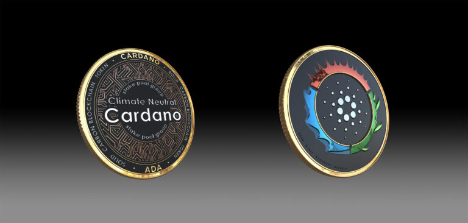

# 🎨 Participating NFT artists and NFT art

#### The utility & value of the CNC Ala token 

Show your impact to the community

Get unique NFTs

Vote for future climate projects

Future carbon credits inbuild

Trade and earn

#### How to claim your NFTs at the end of the ISPO 

Platform details and how it would work.

CNCAla tokens will not be redeemed

NFTs will be distributed through a vending machine based on the number of CNCAla token held in a wallet

#### Future carbon credits in each token 

If the 100,000 plants including fruit trees, shade trees, etc capture x tonnes of carbon over their lifetime if maintained.

### Meet the NFT projects:


[cardano-proxies.md](cardano-proxies.md)



[earth-natives.md](earth-natives.md)



[madas-lemur.md](madas-lemur.md)



[yummi-universe.md](yummi-universe.md)

